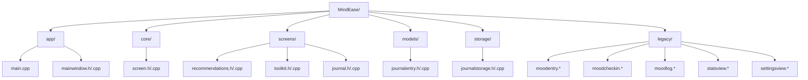
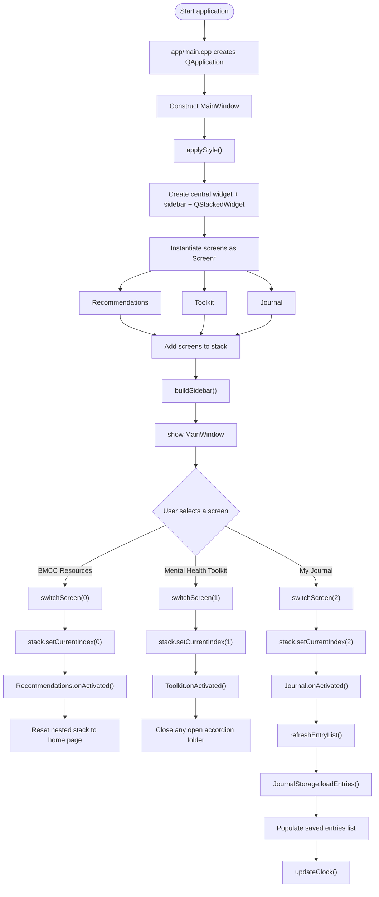
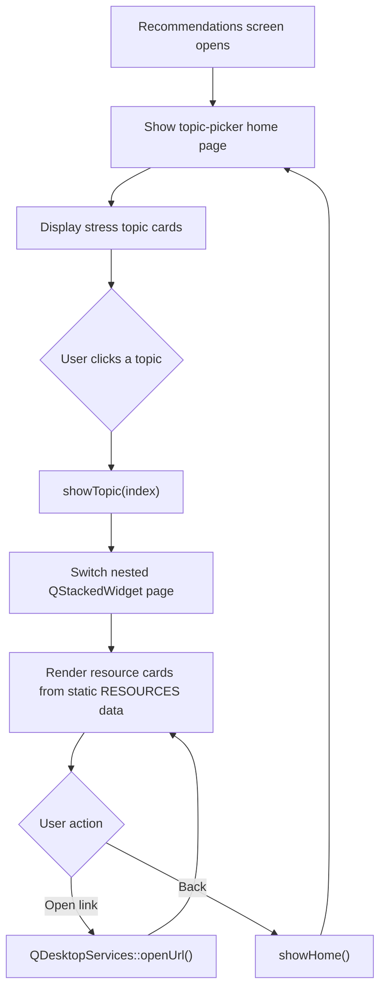
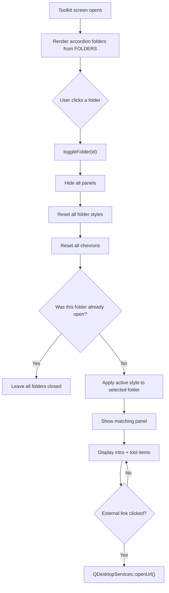
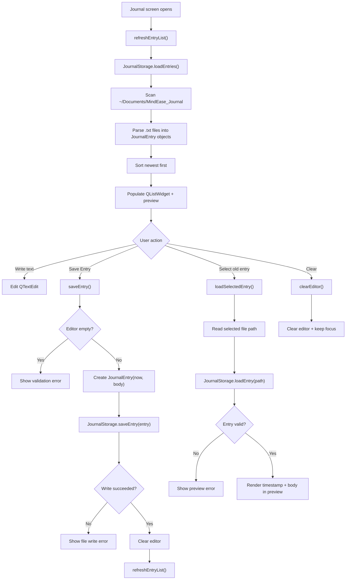
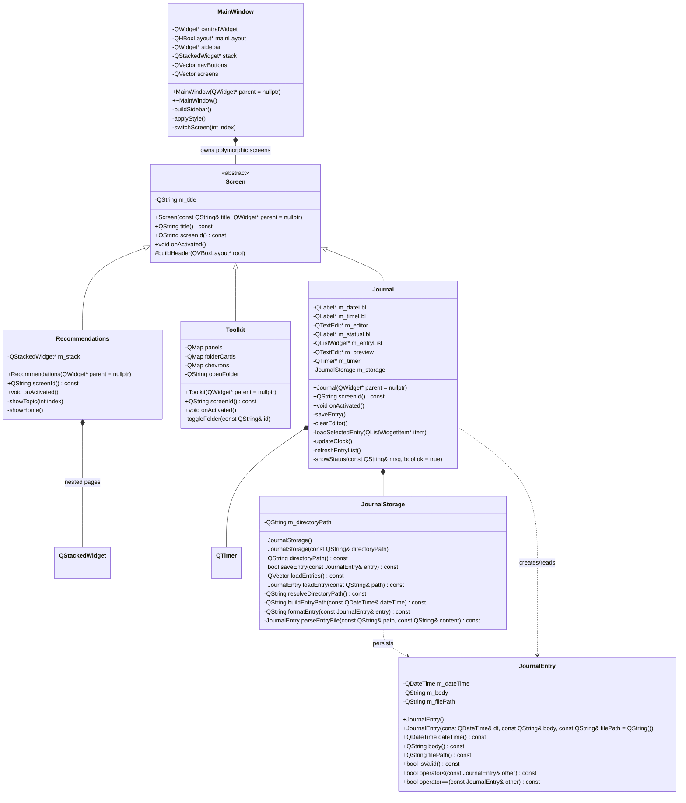
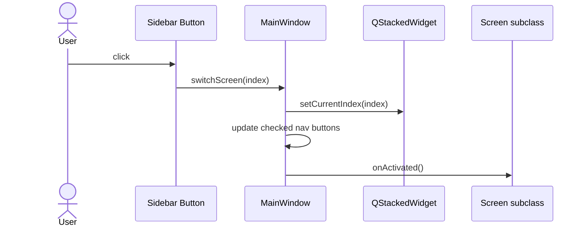
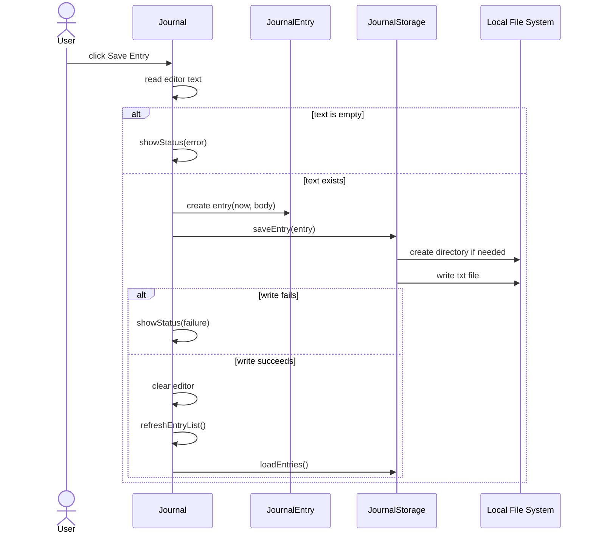

# MindEase Flowchart and UML

These diagrams reflect the current refactored project structure:

- `app/` for startup and application shell
- `core/` for shared abstractions
- `screens/` for UI screens
- `models/` for data objects
- `storage/` for file I/O services
- `legacy/` for older mood-tracking experiments not built by `MindEase.pro`

## 1. Project Structure Diagram

## 2. Main System Flowchart

## 3. Screen Flowcharts

### 3.1 BMCC Resources Screen

### 3.2 Mental Health Toolkit Screen

### 3.3 Journal Screen

## 4. UML Class Diagram

## 5. UML Sequence Diagram

### 5.1 Navigation Sequence

### 5.2 Journal Save Sequence

## 6. Simple OOP Summary

- `MainWindow`:
  app shell and navigation controller
- `Screen`:
  shared abstract base class for all screens
- `Recommendations`, `Toolkit`, `Journal`:
  concrete screen classes using inheritance and polymorphism
- `JournalEntry`:
  simple encapsulated data model
- `JournalStorage`:
  single-responsibility file I/O service

