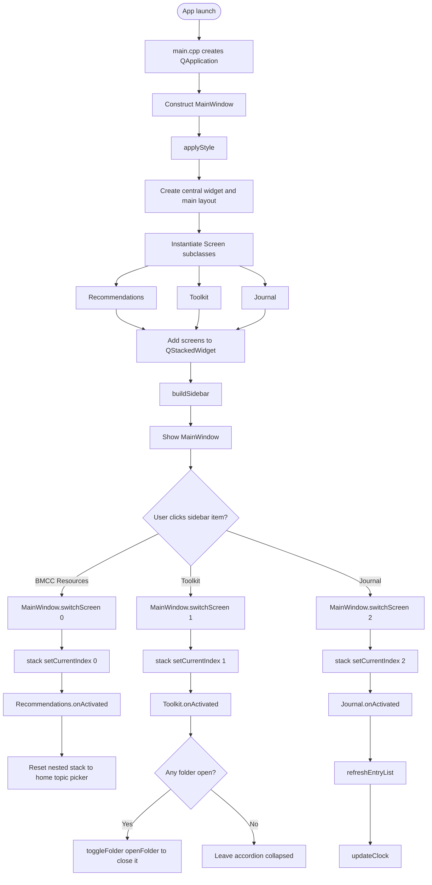
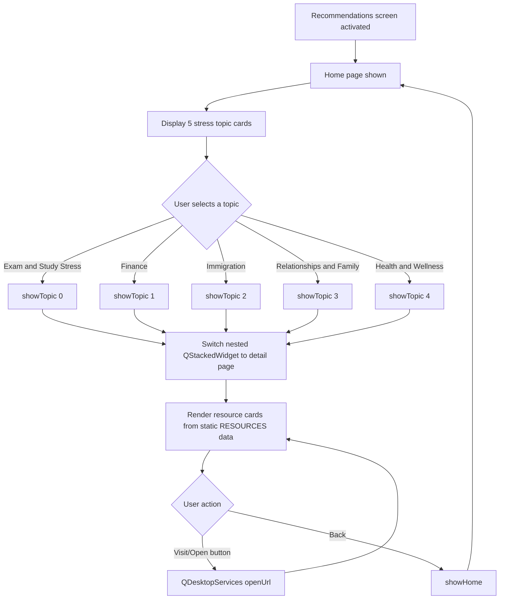
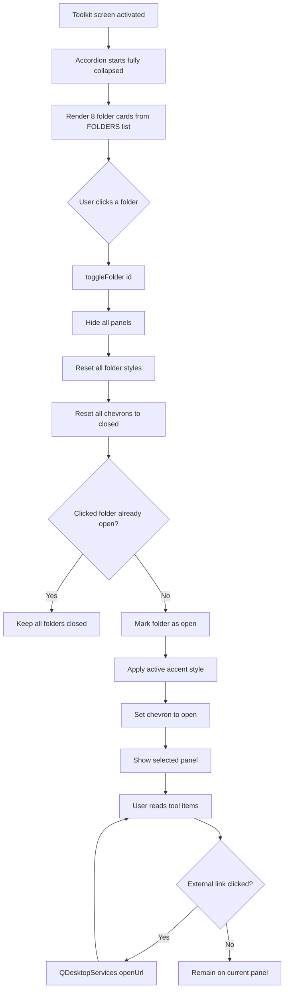
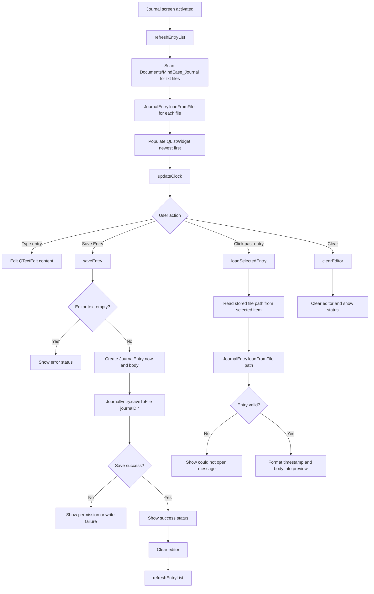
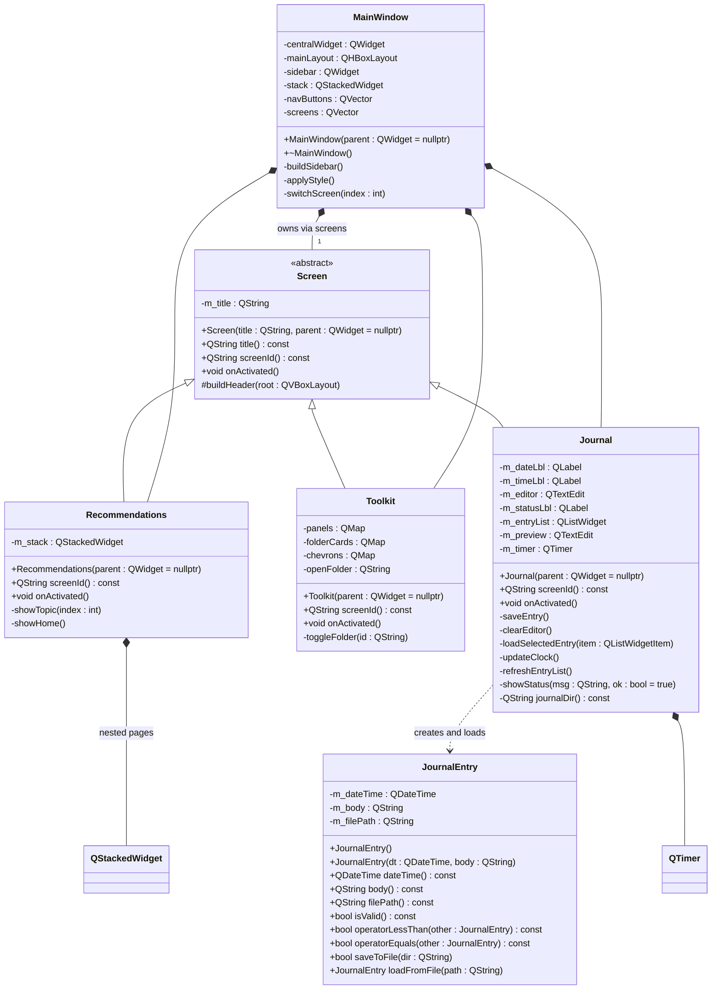
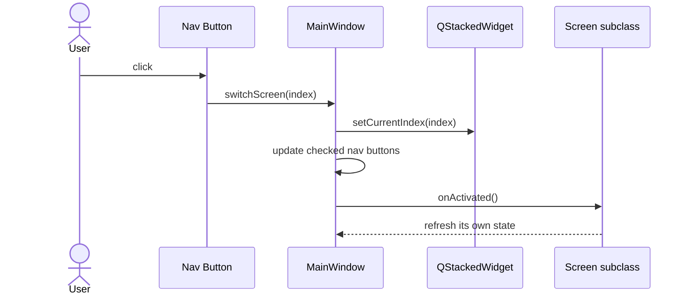
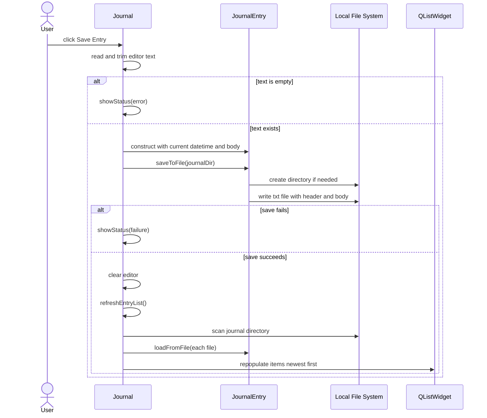
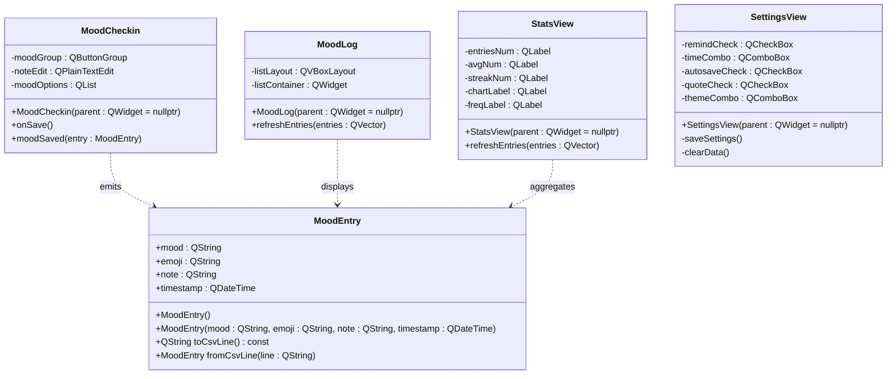

# MindEase Architecture Diagrams

This document reflects the code currently built by `MindEase.pro` and also notes additional classes present in the repository but not compiled into the running app.

## 1. Runtime Flowchart

## 2. Screen-Level Feature Flows

### 2.1 BMCC Resources Flow

### 2.2 Mental Health Toolkit Flow

### 2.3 Journal Flow

## 3. Primary UML Class Diagram

## 4. UML Sequence Diagram

### 4.1 Screen Switching

### 4.2 Journal Save Operation

## 5. Data and Dependency Notes

### 5.1 Current compiled app

- `main.cpp`, `mainwindow.*`, `screen.*`, `recommendations.*`, `toolkit.*`, `journal.*`, and `journalentry.*` are the only files compiled by `MindEase.pro`.
- The running application has exactly 3 sidebar screens:
  - `BMCC Resources`
  - `Mental Health Toolkit`
  - `My Journal`

### 5.2 Repository classes not currently compiled

The following classes exist in the repository, but they are not listed in `MindEase.pro`, so they are not part of the current built application:

- `MoodEntry`
- `MoodCheckin`
- `MoodLog`
- `StatsView`
- `SettingsView`

These appear to belong to an earlier or alternate product direction focused on mood tracking and settings persistence.

## 6. Legacy / Uncompiled UML Snapshot

## 7. Suggested Lucidchart Layout

If you rebuild this in Lucidchart, use three separate pages:

1. `System Flow`
   - App Launch
   - MainWindow Shell
   - Sidebar Navigation
   - Three runtime screens
   - External browser and local file system endpoints

2. `UML - Current Build`
   - `MainWindow`
   - `Screen`
   - `Recommendations`
   - `Toolkit`
   - `Journal`
   - `JournalEntry`

3. `UML - Legacy Repo Classes`
   - `MoodEntry`
   - `MoodCheckin`
   - `MoodLog`
   - `StatsView`
   - `SettingsView`
