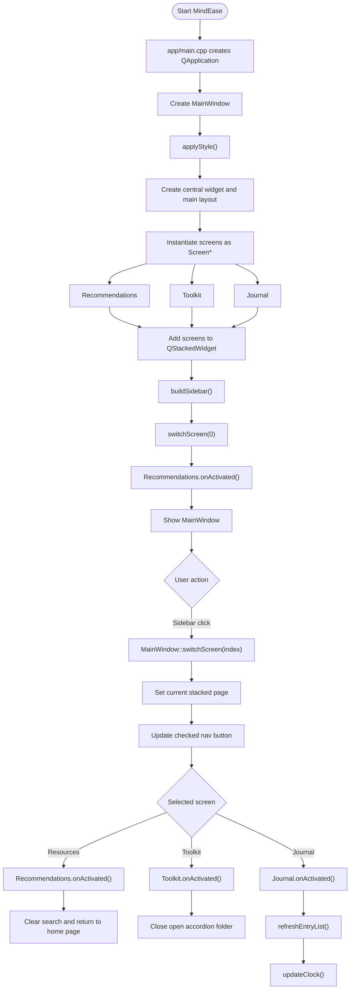
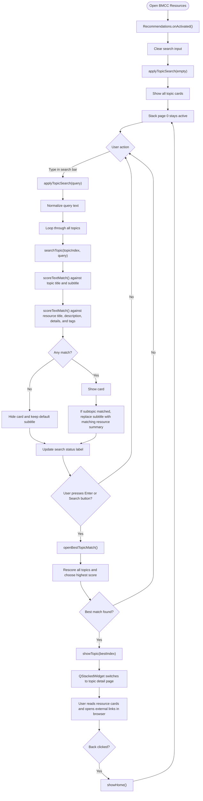
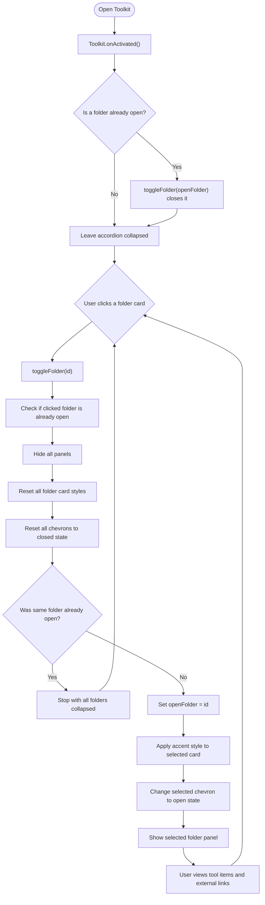
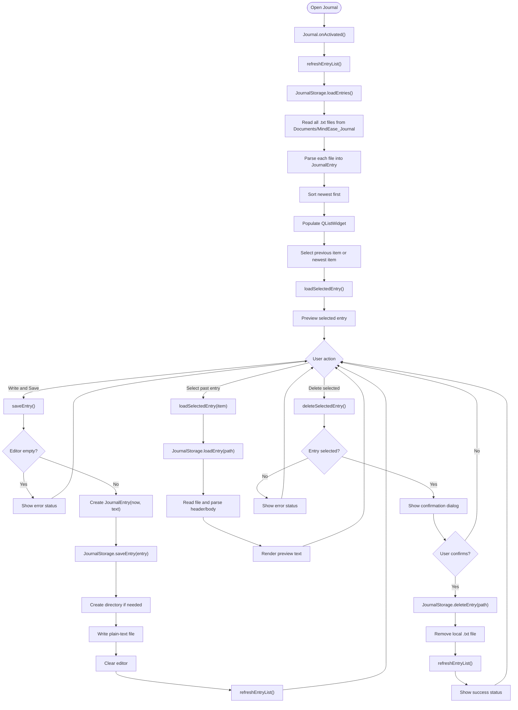
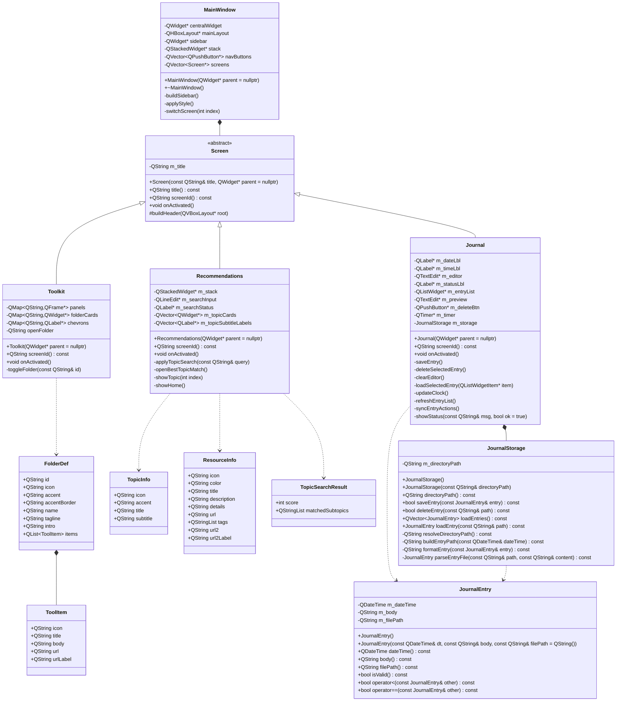
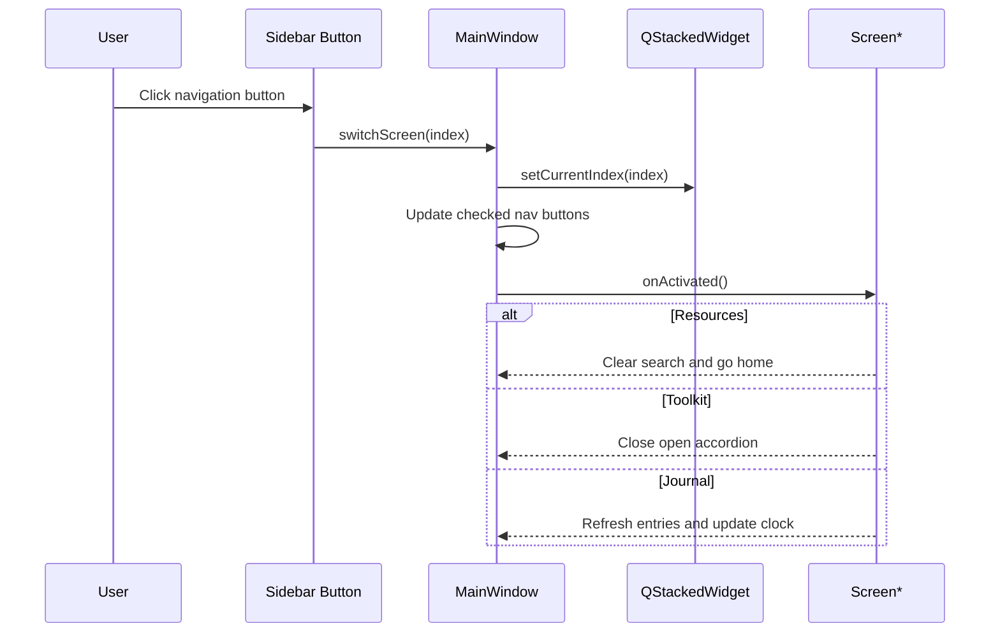
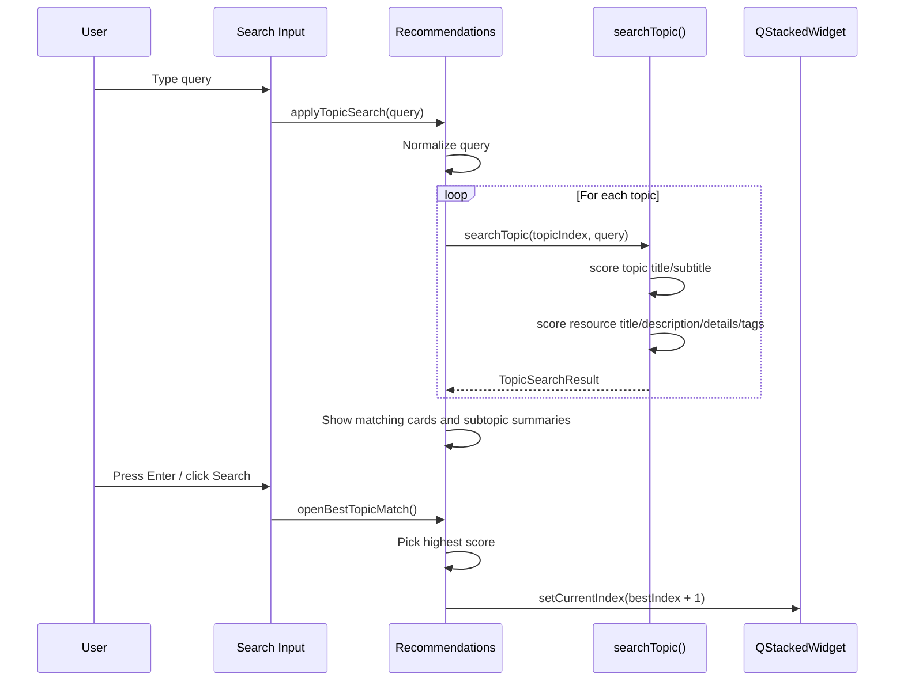
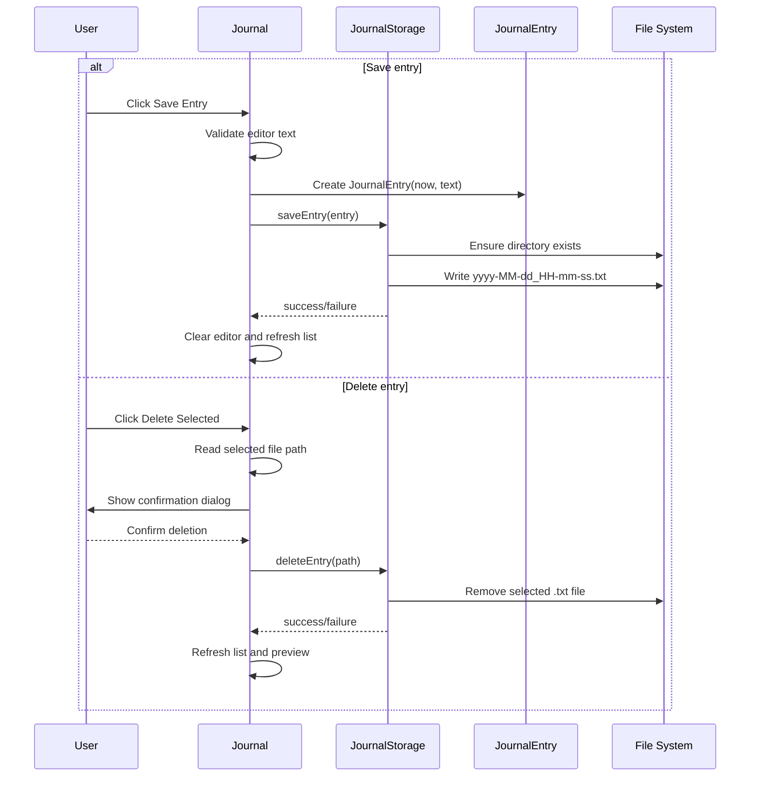

# MindEase Flowchart and UML

This document reflects the current active Qt/C++ application in this repository.
It matches the refactored project structure and includes the current search logic
for BMCC Resources plus journal save and delete behavior.

## 1. Active Project Structure

```text
MindEase/
|- app/
|  |- main.cpp
|  |- mainwindow.h
|  `- mainwindow.cpp
|- core/
|  |- screen.h
|  `- screen.cpp
|- screens/
|  |- recommendations.h
|  |- recommendations.cpp
|  |- toolkit.h
|  |- toolkit.cpp
|  |- journal.h
|  `- journal.cpp
|- models/
|  |- journalentry.h
|  `- journalentry.cpp
`- storage/
   |- journalstorage.h
   `- journalstorage.cpp
```

## 2. Application Flowchart



## 3. BMCC Resources Flowchart



## 4. Mental Health Toolkit Flowchart



## 5. Journal Flowchart



## 6. UML Class Diagram



## 7. UML Sequence Diagram: Navigation



## 8. UML Sequence Diagram: Resources Search



## 9. UML Sequence Diagram: Journal Save and Delete



## 10. Key Design Notes

- `MainWindow` owns the three concrete screens and talks to them through `Screen*`.
- `Screen` is the abstraction layer shared by every page.
- `Recommendations` combines topic browsing with a weighted subtopic search algorithm.
- `Toolkit` is an accordion-style wellness library driven by static folder data.
- `Journal` owns UI state only; persistent file operations are delegated to `JournalStorage`.
- `JournalEntry` is the plain data model for one saved entry.

