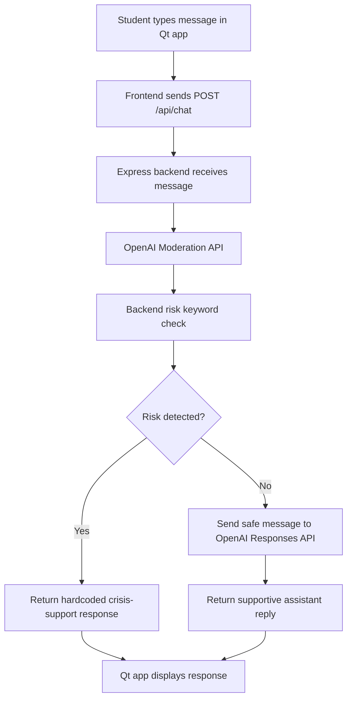

# MindEase — BMCC Wellness Companion

MindEase is a desktop wellness support application built for Borough of Manhattan Community College students. It combines curated BMCC resources, a mental health toolkit, a private local journal, and an OpenAI-powered student wellness assistant in one calm Qt interface.

This project was created for **CSC211H Advanced Programming Techniques (Honors)** at BMCC / CUNY.

> MindEase is not a therapist, doctor, counselor, diagnosis tool, or emergency service. For emergencies or immediate danger, call 911. In the U.S., call or text 988 for crisis support.

## Features

- **BMCC Resources:** Students can search and browse support topics such as study stress, finance, immigration, health, family, and wellness.
- **Resource Search:** Search can match main topics and subtopics, helping students find support faster.
- **Mental Health Toolkit:** Curated self-care folders for academic stress, mindfulness, connection, sleep, music, identity support, nutrition, and journaling.
- **MindEase Assistant:** A student wellness chatbot powered by a small Node.js/Express backend and the OpenAI API.
- **Safety First Chat Flow:** Every chat message is checked with OpenAI Moderation and backend risk logic before a model response is generated.
- **Crisis Routing:** If self-harm, suicide, violence, abuse, immediate danger, or inability to stay safe is detected, the backend returns a hardcoded crisis-support response instead of normal coaching.
- **My Journal:** Private local journal entries saved as plain text files on the user’s machine.
- **Delete Journal Entries:** Saved entries can be removed from the journal screen.
- **Local-first Storage:** Journal files are stored locally, not in a database or cloud account.

## Tech Stack

| Area | Technology |
|---|---|
| Desktop App | C++17, Qt 6 Widgets |
| UI Architecture | `QMainWindow`, `QStackedWidget`, custom `Screen` subclasses |
| Networking | `QNetworkAccessManager` |
| Backend | Node.js, Express |
| AI | OpenAI Responses API |
| Safety | OpenAI Moderation API plus backend keyword/risk checks |
| Storage | Local text files using Qt file I/O |
| Build System | qmake |

## Application Screens

- **BMCC Resources:** Guided resource finder with search and direct links.
- **Mental Health Toolkit:** Self-care and campus wellness tools.
- **MindEase Assistant:** Calm student-support chat for stress, overwhelm, homesickness, loneliness, motivation, and help-seeking.
- **My Journal:** Local journal with save, preview, and delete support.

## Assistant Safety Flow



The assistant is designed for low-risk student support only. It does not diagnose, provide treatment plans, give medication advice, or replace real human help.

## Project Structure

```text
MindEase/
├── .env.example
├── MindEase.pro
├── README.md
├── app/
│   ├── main.cpp
│   └── mainwindow.h / mainwindow.cpp
├── backend/
│   ├── package.json
│   ├── server.js
│   ├── prompts/
│   │   └── mindeaseSystem.js
│   ├── routes/
│   │   └── chat.js
│   ├── services/
│   │   └── openai.js
│   └── templates/
│       └── crisisResponse.js
├── core/
│   └── screen.h / screen.cpp
├── models/
│   └── journalentry.h / journalentry.cpp
├── resources/
│   ├── resources.qrc
│   └── 2025-KYR-Final-01.13.202592.pdf
├── screens/
│   ├── assistantchat.h / assistantchat.cpp
│   ├── journal.h / journal.cpp
│   ├── recommendations.h / recommendations.cpp
│   └── toolkit.h / toolkit.cpp
├── storage/
│   └── journalstorage.h / journalstorage.cpp
├── console_demo/
│   └── simple C++ console demo
└── legacy/
    └── older experiments not built by default
```

## Setup

### 1. Clone the repository

```bash
git clone <your-repo-url>
cd MindEase
```

### 2. Configure the OpenAI API key

Copy the example environment file:

```bash
cp .env.example .env
```

Open `.env` and add your key:

```env
OPENAI_API_KEY=your_openai_api_key_here
OPENAI_MODEL=gpt-4.1-mini
OPENAI_MODERATION_MODEL=omni-moderation-latest
MINDEASE_MAX_OUTPUT_TOKENS=420

HOST=127.0.0.1
PORT=8788
```

Do not commit `.env`. It is ignored by `.gitignore`.

### 3. Start the backend

```bash
cd backend
npm install
npm run dev
```

Expected output:

```text
MindEase backend listening at http://127.0.0.1:8788
```

Health check:

```bash
curl http://127.0.0.1:8788/health
```

Expected:

```json
{"status":"ok","service":"mindease-chat","openaiConfigured":true}
```

Keep the backend terminal running while using the assistant.

### 4. Build and run the Qt app

#### Qt Creator

1. Open Qt Creator.
2. Open `MindEase.pro`.
3. Select a Qt 6 desktop kit.
4. Build and run.

#### Command line

```bash
/Users/phyothihaoo/Qt/6.11.0/macos/bin/qmake -o build/Qt_6_11_0_for_macOS-Debug/Makefile MindEase.pro -spec macx-clang CONFIG+=debug CONFIG+=qml_debug
make -C build/Qt_6_11_0_for_macOS-Debug -j4
open build/Qt_6_11_0_for_macOS-Debug/MindEase.app
```

Your Qt path may be different. If `qmake` is on your PATH, you can use:

```bash
qmake MindEase.pro
make -j4
```

## Journal Storage

Journal entries are saved as plain text files in:

```text
~/Documents/MindEase_Journal/
```

This keeps the journal local and readable without a database or account.

## C++ Concepts Demonstrated

- Object-oriented programming with classes such as `MainWindow`, `Screen`, `Recommendations`, `Toolkit`, `AssistantChat`, and `Journal`.
- Inheritance through the shared abstract `Screen` base class.
- Polymorphism through `Screen*` storage and virtual screen activation.
- Encapsulation through private UI and storage members.
- File I/O through `JournalStorage`.
- Qt signals and slots for navigation, saving, deleting, searching, and sending chat messages.
- Dynamic UI construction from resource data.
- Network requests from Qt to the local Express backend.

## Backend Concepts Demonstrated

- Express route structure.
- Modular OpenAI service layer.
- Environment-based configuration.
- Moderation-first request flow.
- Reusable system prompt.
- Reusable hardcoded crisis response template.
- JSON API responses.
- Basic health route for local testing.

## Safety Notes

MindEase Assistant is for supportive, low-risk wellness guidance. It should not be used for diagnosis, treatment, medication advice, or emergencies.

If a message indicates self-harm, suicide, violence, abuse, immediate danger, or inability to stay safe, the backend returns a crisis-support response and does not call the normal chat model.

Emergency resources:

- Call 911 for immediate danger.
- Call or text 988 in the U.S. for crisis support.
- BMCC Counseling Center: Room S-343, (212) 220-8140, counselingcenter@bmcc.cuny.edu.

## Useful Commands

Backend syntax check:

```bash
cd backend
npm run check
```

Find and stop a backend already using port `8788`:

```bash
lsof -iTCP:8788
kill <PID>
```

## Resources

- [BMCC Counseling Center](https://www.bmcc.cuny.edu/student-affairs/counseling/)
- [BMCC Mental Health Toolkit](https://www.bmcc.cuny.edu/student-affairs/counseling/your-mental-health-toolkit/)
- [BMCC Learning Resource Center](https://www.bmcc.cuny.edu/students/lrc/)
- [BMCC Advocacy & Resource Center](https://www.bmcc.cuny.edu/student-affairs/arc/)
- [988 Suicide & Crisis Lifeline](https://988lifeline.org/)
- [OpenAI API Documentation](https://platform.openai.com/docs/)

## License

Built for academic purposes at BMCC / CUNY. Resource information belongs to the respective BMCC, CUNY, and external organizations.
